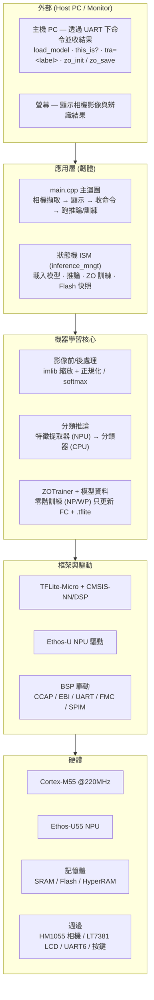

# NuMaker-M55M1 影像分類 + 端側 ZO 訓練 — 架構說明

本文件對應 [Architecture_ZO_Trainer.drawio](Architecture_ZO_Trainer.drawio)，說明程式實作分成哪些模塊、以及用到哪些硬體。

預設組態 `MODEL_MODE = SPLIT`：**NPU 抽特徵 + CPU 分類器**，分類器的 FC 層可在裝置端用零階（Zeroth-Order, ZO）方法微調。

---

## 分層堆疊圖



---

## 模塊說明（由上而下）

| 層 | 模塊 | 對應原始碼 | 職責 |
|---|---|---|---|
| **應用層** | 主迴圈 | `main.cpp` | 相機擷取 → LCD 顯示 → 收 UART 命令/按鍵 → 觸發推論或訓練 |
| | 狀態機 ISM | `Model/inference_mngt.cpp` | 載入模型、推論、ZO 訓練、Flash 快照存讀的流程控制 |
| | 命令 / 狀態 | `uart/uart_cmd.cpp`、`GlobalState.hpp`、`LogConfig.*` | 解析 UART 命令、共享全域狀態、分級日誌 |
| **機器學習核心** | 影像前/後處理 | `ImgClassProcessing.*`、OpenMV `imlib` | 縮放/中央裁切、RGB 正規化、softmax 取 Top-K |
| | 模型封裝 | `Model/MobileNetModel.*` | TFLM Model 封裝 + 算子註冊 |
| | 結果分類 | `Classifier`、`Model/Labels.*` | Top-K 排序、組顯示字串 |
| | **ZOTrainer** | `Model/ZOTrainer.*` | 零階 SGD（節點擾動 NP / 權重擾動 WP），免反向傳播，只更新分類器 FC 層 INT8 權重 |
| | 模型資料 | `Model/*.tflite.cc` | 特徵提取器(NPU/Vela)、分類器(CPU int8)、單體模型變體 |
| **框架與驅動** | 推論框架 | TFLite-Micro + CMSIS-NN / CMSIS-DSP | 解譯器與算子（CPU 路徑） |
| | NPU 驅動 | `NPU/ethosu_*` | Ethos-U 初始化、快取、Profiler |
| | BSP 驅動 | `Library/StdDriver`、`Device/*` | CCAP/EBI/UART/FMC/SPIM/PDMA 等周邊驅動 |

---

## 硬體說明

| 硬體 | 用途 | 經由 |
|---|---|---|
| **Cortex-M55 @220MHz** | 主控、CPU 分類器推論、ZO 訓練（Helium/MVE 向量加速） | — |
| **Ethos-U55 NPU** | 特徵提取器（MobileNetV2 主體）硬體加速 | Ethos-U 驅動 |
| **片上 SRAM** | Tensor Arena（模型啟動緩衝，預設位置） | — |
| **APROM Flash** | 模型權重常數 + ZO 訓練快照（末段保留頁，FNV-1a 校驗） | FMC |
| **外部 HyperRAM 8MB** | 大模型 / 觀測模式的 Tensor Arena（選用） | SPIM0 DMM @0x82000000 |
| **HM1055 攝影機** | 影像輸入 | CCAP |
| **LT7381 LCD** | 顯示相機影像與辨識結果 | EBI |
| **UART6** | 與主機 PC 通訊（命令 / 結果日誌） | — |
| **使用者按鍵** | 觸發 `this_is?` 辨識 | GPIO PI.11 |

---

## 資料流

**推論流**

```
相機 → CCAP → imlib 縮放 → 特徵提取器 (NPU) → 特徵 → 分類器 (CPU) → Top-K → LCD / UART
```

**ZO 訓練流**

```
特徵 → ZOTrainer (CPU, NP/WP 更新 FC INT8) → zo_save → APROM Flash 快照
```

---

## 主要 UART 命令

| 命令 | 說明 |
|---|---|
| `load_model` | 載入分割模型（特徵提取器 + 分類器） |
| `this_is?` | 對當前影格分類（亦可由按鍵觸發） |
| `zo_init` | 以 preserve_all_tensors 重建分類器並建立 ZOTrainer |
| `tra=<label>` | 以指定標籤做一步 ZO 訓練 |
| `zo_lr <val>` / `zo_q <val>` / `zo_method np\|wp` | 設定學習率 / 擾動次數 Q / ZO 方法 |
| `zo_save` / `zo_reset` / `zo_status` | 存快照到 Flash / 還原原始權重 / 顯示狀態 |

> 註：裝置端只負責**量測並回報**每步損失等指標；收斂判斷與停止由主機端依日誌決定。
